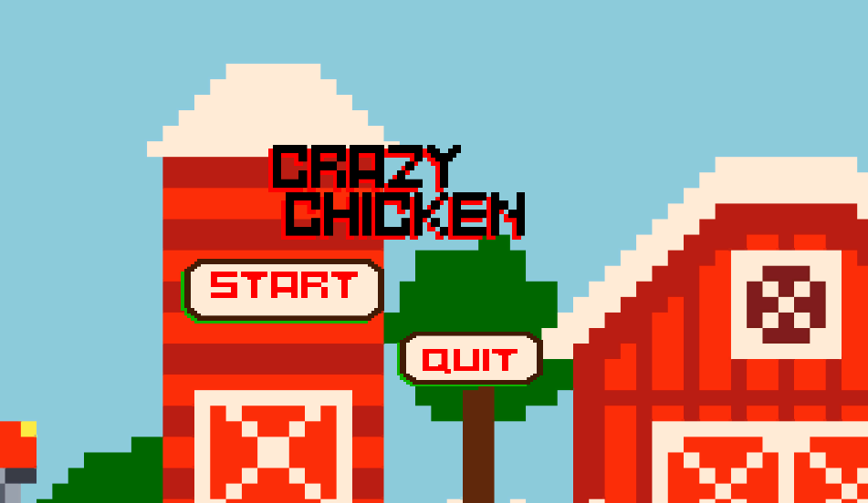

# Jogo-ChikenCrazy
Por: [***Francisco Henrique***](https://www.linkedin.com/in/francisco-henrique-010912189)

### -Projeto desenvolvido utilizando á *Game Engine* [Unity](https://unity.com/) com C#.

## Objetivo
- Apresentar e Orientar como funciona o ChickenCrazy, Projeto 2D.

### Gameplay
- O jogo possui apenas uma fase, onde seu objetivo é coletar o máximo de ovos, sem ser apanhado pela raposa, o jogo tem duração de um minuto, e pode terminar antes caso perca todas suas vidas.

### Controles
* **Seta direcional para Cima:** Faz a galinha pular.
* **Seta direcional Esquerda:** Faz a galinha se mover para a esquerda.
* **Seta direcional Direita:** Faz a galinha se mover para a direita.

## Para Executar:
* WEB: Na pasta Executável-WEB Rode o arquivo index.html e ele abrirá no seu navegador.
* PC: Na pasta Executável-PC rode o arquivo ChickenCrazy.exe e ele abrirá em sua máquina.
